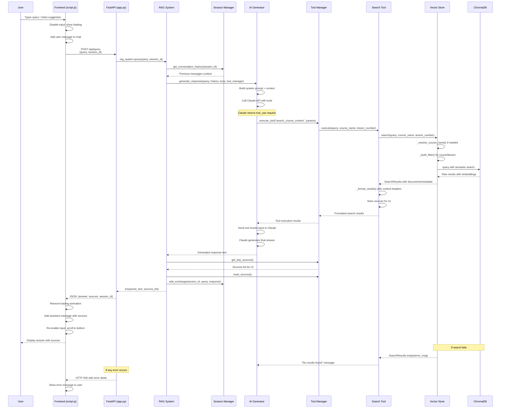

# RAG Chatbot Query Processing Flow

## Key Components Breakdown

### Frontend Layer (script.js)
- **User Interface**: Input handling, message display, loading states
- **API Communication**: HTTP POST to `/api/query` endpoint
- **Session Management**: Tracks `currentSessionId` for conversation continuity

### API Layer (app.py) 
- **Request Handling**: FastAPI endpoint with Pydantic models
- **Session Creation**: Generates new session if none provided
- **Response Formatting**: Structures data for frontend consumption

### RAG Orchestration (rag_system.py)
- **Component Coordination**: Manages AI, search, and session components
- **Context Building**: Combines query with conversation history
- **Source Management**: Collects and resets search sources

### AI Generation (ai_generator.py)
- **Claude Integration**: Anthropic API calls with system prompts
- **Tool Orchestration**: Handles tool use requests from Claude
- **Response Synthesis**: Combines search results into coherent answers

### Search System (search_tools.py + vector_store.py)
- **Semantic Search**: ChromaDB vector similarity search
- **Smart Filtering**: Course name resolution and lesson filtering
- **Context Enhancement**: Adds course/lesson metadata to results

### Data Flow Characteristics
- **Asynchronous**: Frontend uses async/await for non-blocking UI
- **Stateful**: Session manager maintains conversation context
- **Tool-Driven**: Claude autonomously decides when to search
- **Error Resilient**: Multiple fallback layers for graceful degradation